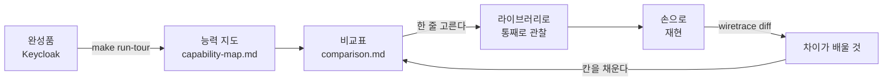
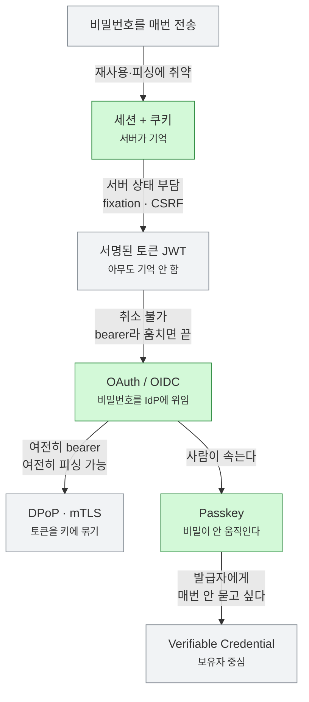
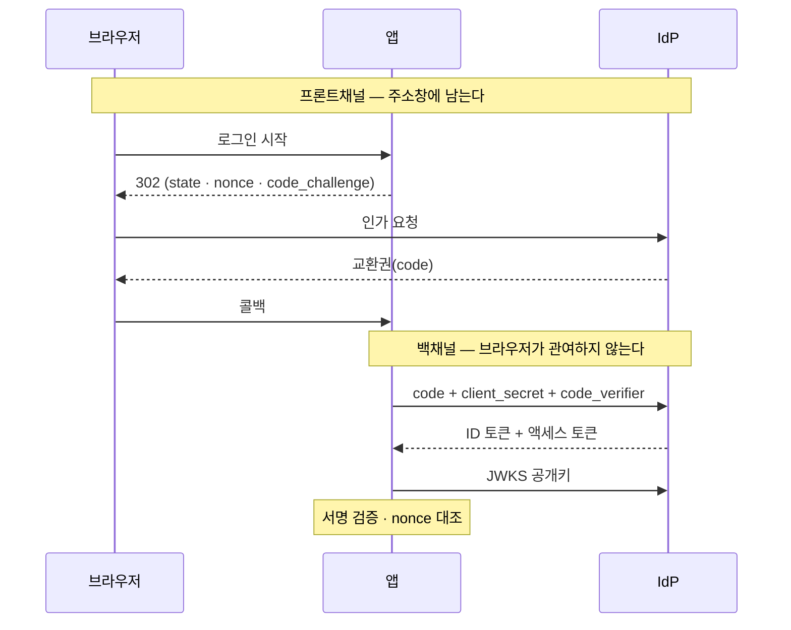

# auth-from-scratch

auth의 **근본 building block** 을 라이브러리 없이 하나씩 만들어보고 나란히 비교하는 학습 저장소.

auth는 둘이다 — **인증(authN, 누구인가)** 과 **인가(authZ, 무엇을 해도 되나).**
세션·토큰·passkey·요청 서명·로그아웃(인증)과 RBAC·ABAC·ReBAC(인가) 같은 조각들이 무엇이고,
**각 조각이 앞의 무엇이 부족해서 나왔으며 무엇을 포기했는지** 를 손으로 확인하는 것이 목표다.
프로덕션 코드가 아니라 이해가 목적이다.

---

## 시작: 완성품을 먼저 본다 (top-down)

밑바닥부터 쌓지 않는다. **완성된 실물 하나를 통째로 보고, 거기서 조각을 역으로 뜯는다.**
그 완성품은 이미 여기서 돈다 — Keycloak, 실제 프로덕션 IdP다.

```bash
make kc-up && make run-tour
```

[`00-reference-tour`](00-reference-tour)가 그 IdP의 능력을 한 장의 지도([`capability-map.md`](00-reference-tour/capability-map.md))로 뽑는다.
아래 표의 거의 모든 행이 그 완성품 안에 이미 기능으로 있다. 챕터는 그걸 하나씩 뜯는 작업이다.



---

## 결과물은 코드가 아니라 표다

[`notes/comparison.md`](notes/comparison.md) — 이 저장소의 정식 목차이자 결과물이다.
방식을 성격별로 세 표에 나눠 담는다.

**표 1. 로그인 방식** — 누구인지 증명하고 로그인 상태를 유지하는 완결된 방법

| 방식 | 상태 위치 | 증명 대상 | 훔치면 끝? | 피싱 저항 | 상태 |
|---|---|---|---|---|---|
| 세션 (서버) | 서버 | 아는 것 | 예 | 없음 | 완료 |
| 세션 (JWT) | 없음 | 아는 것 | 예 | 없음 | lab |
| Kerberos | KDC + 티켓 | 아는 것 | 티켓 수명 내 | 없음 | 읽기만 |
| OIDC | IdP + 클라이언트 | 아는 것 | 예 | 없음 | 완료 |
| SAML | IdP + 클라이언트 | 아는 것 | 예 | 없음 | 읽기만 |
| Passkey | 인증기(기기) | 가진 것 | **아니오** | **있음** | 완료 |

**표 2. 토큰·요청 보호** — 받은 토큰을 어떻게 지키나 (표 1과 직교)

| 기법 | 무엇에 묶이나 | 탈취 재사용 | 상태 |
|---|---|---|---|
| Bearer | 안 묶임 | 그대로 됨 | 완료 |
| HMAC 서명 | 비밀 + 요청 | 안 됨 | |
| DPoP | 클라이언트 키 | 안 됨 | |
| mTLS | 클라이언트 인증서 | 안 됨 | |

**표 3. SSO** — 한 번 로그인을 여러 곳으로. 방식이 아니라 성질이라 따로 본다.

**표 4. 인가 모델 (authZ)** — 누구인지 정해진 뒤 "무엇을 해도 되나"를 판단하는 규칙

| 모델 | 결정 기준 | 유연성 | 잘 맞는 곳 |
|---|---|---|---|
| RBAC | 역할 | 낮음 | 역할 적고 고정적 |
| ABAC | 속성·문맥 | 높음 | 시간·위치·소유가 중요 |
| ReBAC | 관계 | 중간 | 협업·멀티테넌트 |

셋 다 완료 (07). 같은 시나리오에서 RBAC 2건·ReBAC 1건을 표현하지 못했다.

전체 열, SSO 표, 세션 공격·NIST AAL·로그아웃·MFA 절은 [`comparison.md`](notes/comparison.md)에 있다.
빈 칸을 추측으로 채우지 않는다. **이 표는 직접 만들어봐야 생긴다.**

---

## 용어부터

자주 섞여 쓰이는데 층위가 다르다.

| | 무엇인가 |
|---|---|
| **인증 (authN)** | 누구인가. 표 1~3 |
| **인가 (authZ)** | 무엇을 해도 되나. 표 4. 인증 다음 단계이지 같은 것이 아니다 |
| **JWT** | 데이터 **형식**. 서명된 JSON. 그 자체로는 인증이 아니다 |
| **OAuth 2.0** | **위임** 프레임워크. "이 앱이 내 대신 접근해도 된다" |
| **OIDC** | OAuth 위에 얹은 **인증** 레이어. "이 사용자가 누구다" |
| **SSO** | **성질**. 한 번 로그인으로 여러 곳. 구현 방식이 아니다 |

가장 흔한 혼동은 **OAuth를 인증으로 쓰는 것**이다. OAuth는 인가(위임) 프레임워크지 인증이 아니다.
"이 앱이 접근해도 된다"와 "이 사용자가 누구다"는 다른 질문이고, 그 틈을 메우려고 OIDC가 나왔다.
SSO도 오해하기 쉽다 — SAML·OIDC·Kerberos·공유 쿠키 어느 것으로도 되는 성질이지 방식이 아니다.

---

## 다섯 가지 질문

표의 열들은 결국 이 질문들을 묻는다. 방식을 나열하는 대신 질문으로 비교한다.
앞 넷은 인증, 마지막 하나는 인가다.

1. **로그인 상태를 어디에 두나** — 서버가 기억하나, 아무도 기억 안 하나(토큰). 표 1의 `상태 위치`
2. **무엇으로 사람을 증명하나** — 아는 것 / 받는 것 / 가진 것. 표 1의 `증명 대상`, 그리고 MFA
3. **요청을 어떻게 보호하나** — 토큰이 무엇에도 안 묶이나, 키에 묶이나. 표 2
4. **남에게 어떻게 맡기나** — 위임. OIDC / SAML, 그리고 [agent-identity-lab](../agent-identity-lab)
5. **무엇을 해도 되나** — 인가. 역할이냐 속성이냐 관계냐. 표 4

한 방식이 여러 질문에 동시에 답하기도 한다 (OIDC는 1~4를 답한다).
그래서 방식을 한 축에 배치하지 않고, 표에서 방식을 행으로 두고 축마다 채점한다.

---

## 실패 사슬 — 왜 방식이 이렇게 많은가

인증의 역사는 기능 목록이 아니라 **"이게 깨져서 저게 나왔다"의 연속**이다.
각 방식은 앞의 무엇이 부족해서 나왔고, 그 대가로 무엇을 포기했다.



**초록이 여기서 만든 것**이다 — 세션(03), OIDC(00·02·05), Passkey(06).
회색은 아직 안 했거나 다른 곳에서 다룬 것이다. `JWT`는
[agent-identity-lab](../agent-identity-lab)이 이미 깊게 팠고, `DPoP`와 `VC`가 남았다.

화살표에 붙은 말이 곧 **다음 방식이 나온 이유**다. 방식 목록을 외우는 게 아니라
이 사슬을 말할 수 있으면 지도가 생긴 것이다.

---

## 프론트채널과 백채널

OAuth를 이해하는 데 제일 중요한 구조적 사실 하나.
**브라우저를 거치는 길과 서버끼리만 가는 길은 다르다.**



**시크릿이 나와도 되는 자리는 백채널 하나뿐이다.**
`code_challenge`(해시)는 프론트로 가고 `code_verifier`(원본)는 백으로 간다 — 그 비대칭이 PKCE다.

챕터별 백채널 호출 수를 세면 방식의 성격이 드러난다.

| 챕터 | 백채널 | 의미 |
|---|---|---|
| 03 세션 | **0회** | IdP가 없다. 대신 비밀번호를 이 앱이 직접 책임진다 |
| 02 손으로 OIDC | 2회 | 토큰 교환 + JWKS |
| 00 라이브러리 OIDC | 3회 | 위 둘 + 디스커버리 |

---

## agent-identity-lab 과의 분담

[`../agent-identity-lab`](../agent-identity-lab) 은 **agent 서비스에 인증을 붙이는** 저장소다.
OIDC 줄기를 이미 깊게 팠다. 여기서 다시 하지 않는다.

| 주제 | 어디서 |
|---|---|
| 자작 IdP, RS256/JWKS, alg 혼동 공격 | lab phase 2 |
| Authorization Code + PKCE | lab phase 3 (여기 02와 중복. 여기 것은 비교 기준으로 남김) |
| 리프레시, 수명 불일치, durable 세션 | lab phase 5 |
| Token Exchange, OBO, 중첩 `act` | lab phase 4·10·14 |
| step-up consent, confused deputy | lab phase 6·8 |

**저쪽은 응용, 여기는 근본이다.**
저쪽은 "agent에게 어떻게 신원을 주고 사용자 권한을 안전하게 위임하나"라는 한 문제를
OIDC/OBO 한 줄기로 깊게 판다.
여기는 "인증의 building block이 애초에 무엇이고 왜 각각이 필요한가"를 넓게 본다.
세션, Passkey, 요청 서명, 로그아웃, SAML — OIDC가 덮지 않는 조각들이다.

---

## 디렉토리 구조

```
auth-from-scratch/
├── 00-reference-tour/       top-down 진입점. 완성품(IdP) 능력을 지도로
├── 00-first-login-trace/    OIDC. 라이브러리로 로그인 1회 + 와이어 캡처
├── 02-authcode-pkce/        OIDC. 같은 것을 라이브러리 없이
├── 03-session-cookie/       세션+쿠키. IdP 없는 기준선 (IdP 불필요)
├── 04-logout/               로그아웃. 로컬 / RP-Initiated / back-channel
├── 05-jwks-verify/          JWKS 서명 검증. 02·04의 구멍을 막음 (로그인 불필요)
├── 06-passkey/              WebAuthn. 비밀이 움직이지 않는 첫 방식 (하드웨어 불필요)
├── 07-authz-models/         인가. RBAC/ABAC/ReBAC 비교 (IdP 불필요)
├── internal/oidcclient/     02가 손으로 짠 OIDC 클라이언트 (04도 재사용)
│   ├── jwks/                키 캐시, kid 선택, RS/PS 서명 검증
│   └── webauthn/            CBOR 부분집합, COSE 키, 등록·인증 검증
├── internal/
│   └── wiretrace/           모든 방식을 같은 형식으로 기록하는 공용 레코더
├── docker/keycloak/         로컬 IdP. realm 설정은 코드로
├── notes/
│   ├── comparison.md        결과물. 방식 비교표
│   └── diagrams.md          그림 목록
├── docker-compose.yml
└── Makefile
```

번호는 만든 순서다. 읽는 순서가 아니다. 정식 목차는 [`comparison.md`](notes/comparison.md)의 표들이다.

Go 모듈 하나에 챕터가 `main` 패키지로 들어간다.
공용 코드는 `internal/`에 두고 챕터 사이에 복사하지 않는다.

### `internal/wiretrace` 가 이 저장소의 엔진이다

모든 HTTP 왕복을 프론트채널/백채널로 나눠 기록하고, 파라미터마다 "왜 있나" 주석을 붙여
마크다운으로 떨군다. **같은 렌즈로 다른 방식을 찍으면 차이가 눈에 보인다.**

세션 로그인 트레이스와 OIDC 트레이스와 Passkey 트레이스를 같은 형식으로 놓고 비교하는 것이
표를 채우는 방법이다.

---

## 그림

용어를 모르는 상태에서 시작할 수 있게 세 장을 순서대로 둔다.
전체 목록은 [`notes/diagrams.md`](notes/diagrams.md).

1. [가장 쉬운 그림 - 로그인이란](https://app.excalidraw.com/s/AU3bkHPBsIE/4o7ZsmOJtq2) — 프로토콜 용어 없음
2. [로그인 한 번에 무슨 일이 일어나나](https://app.excalidraw.com/s/AU3bkHPBsIE/VeJ6rXc0py) — 1번과 같은 레이아웃에 진짜 이름
3. [PKCE - 가루와 원본](https://app.excalidraw.com/s/AU3bkHPBsIE/74Xaul0gvdJ)

---

## 각 챕터의 완료 조건

**필수는 둘뿐이다.**

1. 동작하는 최소 코드 — 그 방식을 손으로 시연
2. **`notes/comparison.md` 에 한 줄 추가** — 시연한 것에서 채운다, 추측 금지

권장 (하면 이해가 깊어지는 것, 안 해도 됨)

- 공격 재현 — 검증을 한 줄 빼면 어떻게 뚫리는지 실제로 실행
- README에 "이 방식은 앞의 무엇이 부족해서 나왔나" 한 문단
- 각 README의 `생각해볼 질문` 에 스스로 답해보기 (별도 답안 파일은 없다. 답은 코드와 트레이스에 있다)

---

## 실행

```bash
make kc-up      # 로컬 IdP (D 계열 챕터에서 필요)
make run-00     # -> http://localhost:5556
make run-02     # 00과 같은 포트. 동시에 못 띄운다
make help       # 전체 타깃
```

로그인 계정 `alice` / `alice`, 관리 콘솔 http://localhost:8080 (`admin` / `admin`).

주의할 점은 [`docker/keycloak/README.md`](docker/keycloak/README.md) 에 모아뒀다.
realm 설정은 코드이고, 파일을 고쳤으면 `make kc-up` 이 아니라 **`make kc-reset`** 이다.

---

## 스펙 읽는 순서

| 스펙 | 내용 | 관련 |
|---|---|---|
| RFC 6265 | HTTP 쿠키 | 세션 |
| RFC 7519 | JWT | 세션(JWT) |
| RFC 4120 | Kerberos | Kerberos |
| RFC 6749 / 6750 | OAuth 2.0 코어, Bearer 사용법 | OIDC, Bearer |
| OIDC Core 1.0 | 인증 레이어 | OIDC |
| RFC 7636 | PKCE | OIDC |
| **RFC 9700** | OAuth 2.0 Security BCP | 전체 |
| RFC 6238 | TOTP | MFA |
| WebAuthn L3 / CTAP2 | Passkey | Passkey |
| RFC 9421 | HTTP Message Signatures | HMAC 서명 |
| RFC 9449 | DPoP | DPoP |
| OIDC RP-Initiated / Back-Channel Logout, SAML SLO | 로그아웃 | SSO |

**RFC 9700은 필독.**
앞의 것들을 읽고 나서 보면 "왜 이렇게 설계했는지"가 역으로 이해된다.

---

## 참고 코드베이스

| 저장소 | 언어 | 왜 |
|---|---|---|
| `ory/fosite` | Go | 스펙을 거의 1:1로 옮겨놓음. RFC와 나란히 읽기 최적 |
| `dexidp/dex` | Go | 작고 완결된 OIDC provider |
| `go-webauthn/webauthn` | Go | Passkey의 정답지 |
| `oauth2-proxy/oauth2-proxy` | Go | 세션·토큰을 다루는 실전 패턴. 세션·로그아웃 |
| `crewjam/saml` | Go | SAML 읽기용 |
| `panva/jose` | JS | JWS/JWE/JWK 스펙 충실도 최고 |

---

## 주의

이 저장소의 코드는 **학습 목적** 이다.
프로덕션에서는 검증된 라이브러리를 써야 한다.
직접 구현한 인증 코드는 거의 항상 취약하며, 이 저장소의 목적은 그 라이브러리들이
무엇을 대신 해주고 있는지 이해하는 것이다.
